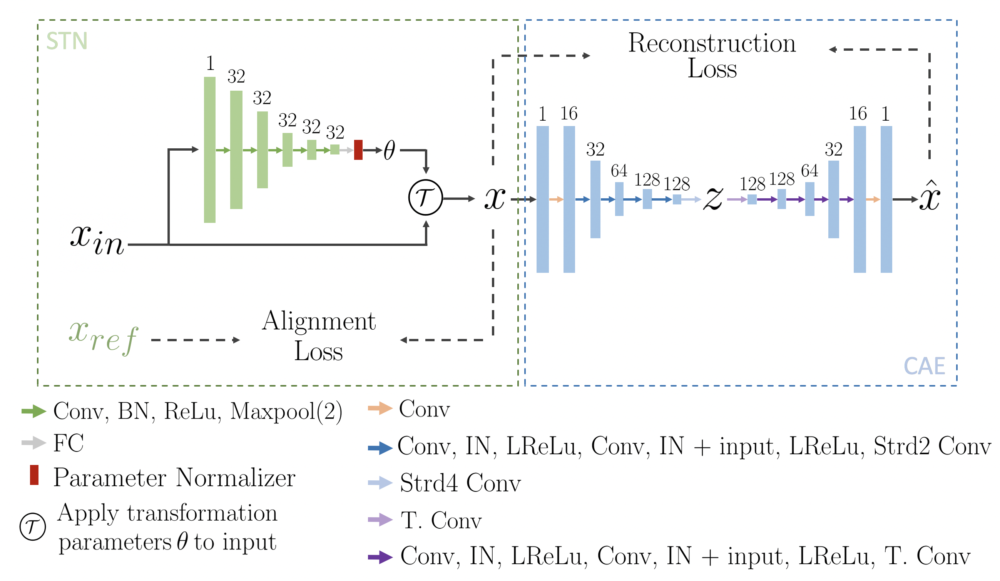

# A Convolutional Autoencoder Approach to Learn Volumetric Shape Representations for Brain Structures (vr.1)



LINK: https://arxiv.org/abs/1810.07746

## Abstract

We propose a novel machine learning strategy for studying neuroanatomical shape variation. Our model works with volumetric binary segmentation images, and requires no pre-processing such as the extraction of surface points or a mesh. The learned shape descriptor is invariant to affine transformations, including shifts, rotations and scaling. Thanks to the adopted autoencoder framework, inter-subject differences are automatically enhanced in the learned representation, while intra-subject variances are minimized. Our experimental results on a shape retrieval task showed that the proposed representation outperforms other benchmark methods for brain structures extracted from MRI scans. 

## Requirements
- Pytorch (0.4.0)
- Numpy

## How to use (vr.1.1)
The tools you need to make the architecture is on the *functions* folder. The autoencoder model is in *model.py* whereas the spatial transformer is in the *stn_library.py*. An example of how use the model is shown below. 

```python
import torch.nn.functional as F
from functions import models as m
from functions import misc as misc
from functions import stn_library as sl
from functions import training_tools as tt

grid_generator= sl.Grid_Generator(batch_size, 80, 80, 80) 
#E.g. the brain regions where in a 80x80x80 volume

'''Spatial Transformer'''
# If euclidean is true, then the model considers
# rigid transformation with rotation and translation parameters. 

stn = sl.VGG(euclidean = euclidean)
stn.cuda()

'''Shape Descriptor'''
# max_ch length of the descriptor/bottleneck
cfg = misc.get_cfg(max_ch)
model = m.CAE(m.make_resnet(cfg))
model.cuda()   

'''During Training'''
theta = stn(x) #x is your batch, theta are the learned transformation parameters
theta = sl.theta_norm(theta, euclidean)
flow = grid_generator.deformed_grid(theta, euclidean, rot_only=False)
x_oriented = F.grid_sample(x, flow, mode='linear')
transformer_loss = tt.dice_loss(x_oriented, template) # template is a reference template

'''Autoencoder'''
z, recon = model(x_oriented)
recon_loss = tt.dice_loss(recon, x_oriented)

'''Losses'''
total_loss = alpha*transformer_loss + tt.Zeta(epoch)*recon_loss
```

## Contact
If you find any bugs or have any questions, we encourage you to report the bugs or ask Evan Yu (emy24@cornell.edu).

